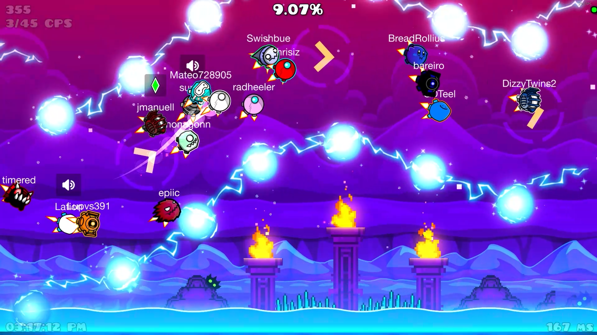

# Globed

Globed is an open-source, highly customizable multiplayer mod for Geometry Dash.

This version of Globed supports Geode v4.10 and GD 2.2074. For older versions, see:
* Globed v1 (GD 2.200 to 2.2074) -> [legacy-v1 branch](https://github.com/GlobedGD/globed2/tree/legacy-v1), [releases](https://github.com/GlobedGD/globed2/releases) before v2.0.0
* Globed v0 (GD 2.113) -> [dankmeme01/globed](https://github.com/dankmeme01/globed) repository

## Installation

Globed is a [Geode](https://geode-sdk.org/) mod, so it requires you to install Geode first. Once that's done, simply open the mods page in-game and download it from the Geode Index.

## Features

* Real-time multiplayer
* Available for all platforms supported by Geode: Windows, Android, MacOS and iOS
* 2-player mode for beating 2P levels together over the internet
* Other fun modes, such as Death Link, Collision, Switcheroo
* In-game communication via voice chat and emotes
* Public & private rooms
* Completely free and open-source, with ability to host your own server

## Hosting a server

See the [Server Hosting](./docs/server-hosting.md) page for more information about hosting a server. If you have any troubles or suggestions, you can join our [Discord server](https://discord.gg/d56q5Dkdm3) or make an issue.

## Building

For the most part building is the same as any other mod, see the [Geode documentation](https://docs.geode-sdk.org/getting-started/cpp-stuff). Additionally:
* Python 3.12 is required (Globed uses [geobuild](https://github.com/dankmeme01/geobuild/))
* Clang is required, other compilers are unsupported

## Credit

Globed is made by:

* [dank_meme](https://github.com/dankmeme01) - owner and main developer
* [ItzKiba](https://github.com/ItzKiba/) - artist, developer
* [Dasshu](https://github.com/DasshuDev/) - artist
* [TechStudent10](https://github.com/TechStudent10) - developer
* [ninXout](https://github.com/ninXout/) - developer

and the rest of our awesome [contributors](https://github.com/GlobedGD/globed2/graphs/contributors)!

Special thanks:

* [availax](https://availax.xyz/) - for co-creating the mod and helping with everything for a long time
* MathieuAR - for providing us server hosting
* HJfod - for making [our website](https://globed.dev)
* alk1m123 - for working together for EditorCollab interoperability
* Alphalaneous - for making the DeathLink mod and allowing us to take their idea and implement it in Globed
* Rifct - for helping with some assets
* [ConfiG](https://github.com/cgytrus/) - for hosting a relay server in Russia
* [Everyone from the Geode Team](https://github.com/orgs/geode-sdk/people) - for making Geode
* Server staff and supporters - for helping in shaping this mod to be what it is today :)

### Used libraries

These are the libraries used by Globed, either directly or indirectly by one of dependencies made by us. Without them, Globed wouldn't exist ❤️

* [Geode](https://github.com/geode-sdk/geode)
* [Cap'n Proto](https://capnproto.org/)
* [opus](https://github.com/xiph/opus)
* [{fmt}](https://github.com/fmtlib/fmt)
* [zstd](https://github.com/facebook/zstd)
* [lz4](https://github.com/lz4/lz4)
* [BLAKE3](https://github.com/BLAKE3-team/BLAKE3)
* [nontype_functional](https://github.com/zhihaoy/nontype_functional)
* [c-ares](https://github.com/c-ares/c-ares)
* [wolfSSL](https://github.com/wolfSSL/wolfssl)
* [ngtcp2](https://github.com/ngtcp2/ngtcp2)
* [Qunet](https://github.com/dankmeme01/qunet-cpp) (by dankmeme01)
* [asp2](https://github.com/dankmeme01/asp2) (by dankmeme01)
* [arc](https://github.com/dankmeme01/arc) (by dankmeme01)
* [qsox](https://github.com/dankmeme01/qsox) (by dankmeme01)
* [UIBuilder](https://github.com/camila314/uibuilder) (by camila314)
* [cue](https://github.com/dankmeme01/cue) (by dankmeme01)
* [Argon](https://github.com/GlobedGD/argon) (by dankmeme01)
* [sinaps](https://github.com/Prevter/sinaps) (by Prevter)
* [AdvancedLabel](https://github.com/Prevter/AdvancedLabel) (by Prevter)
