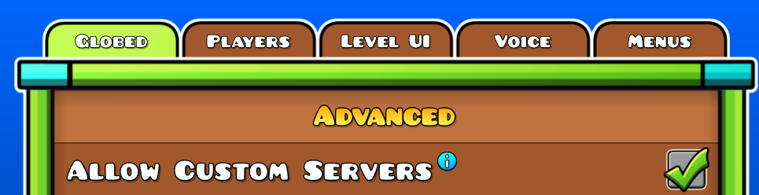
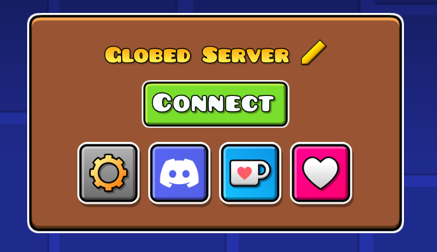
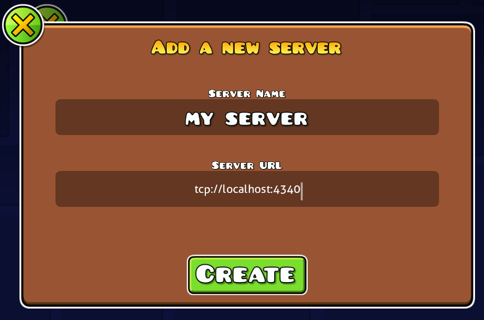

# Server Hosting

A Globed server has two parts: a central server and a game server. This page will cover setting up and configuring both of them. You must have one central server that will handle all connections, and then one or multiple game servers to handle actual gameplay. Players are able to freely move between game servers and by default will prefer the one with the least latency.

Both servers can be ran as executables or as a Docker container. Up-to-date information on running them can be found in their respective repositories: [central server](https://github.com/GlobedGD/central-server), [game server](https://github.com/GlobedGD/game-server). If you do not have a GitHub account, or for any other reason cannot find the GitHub Actions builds, we also publish server binaries for every [mod release](https://github.com/GlobedGD/globed2/releases/latest). These may be slightly out of date, as the server might be updated without a mod update, so prefer getting the builds from the server repository.

The next sections assume that you have already successfully launched the server once. The central server does not require any pre-configuration, and if you launched it properly, it should greet you with the following message:

```log
INFO central_server::core::handler: Globed central server is running!
```

The game server will instead print the following message and exit:

```log
ERROR game_server: Central server URL is not set, please set it in the config file.
```

We will fix this later, once we finish setting up the central server.

## Central Server setup

Upon running the server for the first time, a `config` folder will be created in the current directory, where every server module will put its default config files. In-depth configuration is described [below](#central-server-configuration) and is worth reading, but for now we want to just get the server working so we will only focus on a few options.

In `config/core.toml`, find the `tcp_address` option and ensure that it is bound in a way that will be reachable from the outside. The default of `[::]:4340` will listen for IPv4 and IPv6 connections on all network interfaces on port 4340. If you want to use only IPv4, change it to `0.0.0.0:4340`.

Once you've launched the server (and optionally configured the TCP address), you can now try connecting to it. First, enable the Allow Custom Servers option in Globed settings. This will add a pencil button on the connection menu, and allow you to add a new server




Here, server name can be anything you want. Server URL should be the URL that Globed will try to connect to. If you haven't changed the configuration, it should be `tcp://localhost:4340`. For connecting from other devices, `localhost` has to be replaced with your LAN IP, public IP or a VPN IP if using things like Radmin VPN. **Do not put 0.0.0.0 here.** That will not work. For more informations on the URL format, see [here](#url-format)

If you did everything successfully, you should be able to connect without any issues 🎉

## Game Server setup

After successfully getting a central server working, you likely want to set up a game server, to be able to, y'know, actually play the game. Similar to the central server, simply running the server should initially work fine and will create a `config.toml` file.

Going back to the central server, in the `config/core.toml` file you will need to find and copy the `gs_password`, as well as ensure that `gs_tcp_address` has an address that is reachable from your game servers. The default of `[::]:4342` will listen for IPv4 and IPv6 connections on port 4342.

Open the `config.toml` file of the game server and set the following values:
* `central_server_password` - to the password obtained earlier
* `central_server_url` - to the URL of the central server. **Note: you cannot use `tcp_address` for this, you must use `gs_tcp_address`**. For example, if the default of `[::]:4342` or `0.0.0.0:4342` was used, this will be `tcp://localhost:4342`. If the game server is on another machine, replace `localhost` with the IP of the central server and ensure the port is reachable.

If done correctly, the server should now launch and display the following message:

```log
INFO game_server::handler: Globed game server is running! Build date: ...
```

For extended configuration, see [Game Server Configuration](#game-server-configuration)

## Central Server Configuration

This section will describe (almost) all configuration options for every module. It's not complete, so if you have any doubts or questions, feel free to ask more on our [Discord server](https://discord.gg/d56q5Dkdm3).

### Core
```toml
# core.toml

# How much memory to pre-allocate for certain socket operations
# This is a value from 1 to 11, and the recommended value depends on the activity you expect.
# 1-3 - < 1MB of buffers, recommended for < 100 player servers
# 4-6 - < 16MB of buffers, recommended for servers handling thousands of players
# 7-10 - buffer usage doubles with each extra level, only recommended for extremely active servers
# 11 - 1GB of buffers, absolute overkill :)
# This number matters the most for the game server, but the central server benefits from it as well.
memory_usage = 3
# How aggressive compression of messages should be.
# 0 - never compress
# 1 - use LZ4 for messages >= 512 bytes
# 2 - use LZ4 for >= 256 bytes, ZSTD for >= 16384 bytes
# 3 (default) - use LZ4 for >= 256 bytes, ZSTD for >= 4096 bytes
# 4,5 (adaptive) - use LZ4 as a heuristic, then decide to use LZ4 or ZSTD depending on compressability & size
# 6 - use LZ4 for >= 128 bytes, ZSTD for >= 256 bytes
# LZ4 is extremely fast, much faster than ZSTD, but often has worse compression.
#
# The default level of 3 is recommended for most cases.
# If compression eats too much CPU, levels 0-2 can be used instead.
# If bandwidth usage is a big concern, levels 4-6 should be used (though central server barely uses any bandwidth)
compression_level = 3

# Whether to enable logging to a file. If disabled, logs will only be printed to the console
log_file_enabled = true
# The directory where logs will be stored
log_directory = "logs"
# Minimum log level to print to the console, logs below this level will be ignored.
# Valid values: trace, debug, info, warn, error
console_log_level = "info"
# Minimum log level to print to the log file, logs below this level will be ignored.
# Valid values: trace, debug, info, warn, error
file_log_level = "info"
# Prefix for the filename of the log files (if rolling is disabled, it's just the filename)
log_filename = "central-server.log"
# Whether to roll the log file daily, instead of appending to the same file every launch.
# Will append the current date to the filename
log_rolling = false

# Whether to allow incoming QUIC connections, requires setting the address and paths to TLS certificate + key files
enable_quic = false
quic_address = "[::]:4341"
quic_tls_cert = ""
quic_tls_key = ""

# Whether to enable incoming TCP connections
enable_tcp = true
tcp_address = "[::]:4340"

# Whether to enable incoming UDP connections
enable_udp = true
udp_address = "[::]:4340"
# Whether to use UDP solely for discovery purposes, and disallow actual connections.
# It's recommended to keep this at `false`, for quicker connections when not specifying a protocol.
udp_ping_only = false

# Path to the QDB file (this is all i can say because it's a complicated thingy)
qdb_path = ""

# The password that the connecting game servers must supply to connect.
# Make sure to not share this to anyone!
gs_password = "..."
# Address for accepting TCP connections from game servers, or blank to disable TCP
gs_tcp_address = "[::]:4342"
# Address for accepting QUIC connections from game servers, or blank to disable QUIC
gs_quic_address = ""

# Override the base URL used for communication with the GD servers.
# Change this if you are hosting a server for a GDPS
gd_api_base_url = "https://www.boomlings.com/database"
# Auth token for GD API requests. Currently does nothing unless
# GDProxy is used (https://github.com/dankmeme01/gdproxy/)
gd_api_auth_token = ""
```

### Authentication

```toml
# auth.toml

# Secret key used for signing utokens, 256-bit hex string
secret_key = "..."
# How long until utokens expire, in seconds
# A utoken is a temporary token issued to the user on every connection,
# so they can avoid re-authenticating with Argon too often.
token_expiry = 604800
# Whether to enable Argon authentication. If disabled, players can impersonate other accounts.
# GDPS owners probably want to keep this disabled or set up their own Argon server
enable_argon = false
argon_token = "..."
argon_ping_interval = 30
argon_disconnect_timeout = 45
```

### Credits

```toml
# credits.toml

# How long (in seconds) until credits should be refreshed
credits_cache_timeout = 86400
# How often (in seconds) to make requests to the GD server while fetching user profiles
credits_req_interval = 1

# Below is an example of creating two credits categories,
# one that shows all users that have a specific role, and one with hardcoded account IDs

[[credits_categories]]
name = "Staff"
sync_with_role = "staff"
# Optional, can be specified to ignore certain users e.g. test / alt accounts
ignored = [
    12345678
]

[[credits_categories]]
name = "Special Thanks"
users = [
    # Will fetch the user by the account ID and display their in-game username
    { id = 29843187 },
    # Will fetch the user and display "Bot" as the username
    { id = 29843187, display_name = "Bot" },
]
```

### Discord

```toml
# discord.toml

# Whether to enable the built-in Discord bot
enabled = true
token = ""
# Main ID of your guild, if set, commands will only be enabled there instead of globally
main_guild_id = 0
# ID of the channel where various alerts go
alert_channel = 0
```

### Featured levels

```toml
# featured-levels.toml

database_url = "sqlite://features.sqlite?mode=rwc"
database_pool_size = 5

# Google spreadsheets ID where featured levels should be pushed
# You need to create a service account and get a credentials json file to use this
spreadsheet_id = ""
google_credentials_path = ""

# How often to cycle features by default, in seconds
feature_cycle_interval = 86400
# ID of the channel and message to send if no levels are available to feature (Discord module must be enabled)
exhaust_notif_channel = 0
exhaust_notif_message = ""
# ID of the channel and message to send when a level is featured (Discord module must be enabled)
feature_notif_channel = 0
feature_notif_message = ""
```

```toml
database_url = "sqlite://db.sqlite?mode=rwc"
database_pool_size = 5

# Super admins have no password and are considered above every role.
# They are allowed to do virtually any moderation action on Globed.
super_admins = [12345678]

# Channel where moderation logs will be sent (Discord module must be enabled)
mod_log_channel = 1219448690641735700

# Set whether players must be explicitly whitelisted before being able to join the server
whitelist = false
# Set whether using voice chat should require the user to link their Discord account
vc_requires_discord_link = false
# Set whether setting room names will be disallowed for users by default
disallow_room_names = false

script_sign_key = "52e047459f5d85bc1d0435f68347322592efd3809d449d35c302ee54a8823f76"

[punishment_reasons]
# Set the default mute / ban / room ban reasons available to moderators
mute = ["reason 1", "reason 2", "reason 3"]
ban = ["reason 1", "reason 2", "reason 3"]
room_ban = ["reason 1", "reason 2", "reason 3"]

# Below are a few examples of creating roles
# Most of the keys are optional and don't have to be specified
[[roles]]
id = "owner"
priority = 100000
icon = "role-owner.png" # can be any sprite in Globed or GD
# Name colors have three valid formats:
# "#aabbcc" - standard RGB color in hex format
# "#aabbcc > ddeeff > 112233 > ..." - tinting (lame) color
# "#aabbcc | ddeeff | 112233 | ..." - gradient (awesome) color
# The example below creates a (roughly) rainbow gradient name color
name_color = "#ff3880 | ff843d | ffed78 | 59ff51 | 5fffec | 7d9eff | d786ff | ff46cc"
# Links this role with a Discord role
discord_id = 0
# Various permissions
can_name_rooms = true
can_kick = true
can_mute = true
can_ban = true
can_set_password = true
can_notice_everyone = true
can_edit_roles = true
can_send_features = true
can_rate_features = true

[[roles]]
id = "staff"
priority = 90000
# Hide this role, don't show its badge
hide = true
can_name_rooms = true

[[roles]]
id = "supporter"
# Low priority ensures staff can perform any action on them
priority = 1000
icon = "role-supporter.png"
```

## Game Server Configuration

```toml
# config.toml

# See description in central server's core.toml
memory_usage = 3
compression_level = 3

# URL and password of the central server to connect to
central_server_url = ""
central_server_password = ""

quic_cert_path = ""

# The name of the server that will be shown to users
server_name = "Main server"
# Unique server ID, must not be shared between multiple game servers
server_id = "main-server"
# Region string, for displaying to the user
server_region = "Global"
# The URL that will be used to connect to this server.
# To be publicly reachable, this must include a domain name or a public IP address.
# If left blank, it will be set to `(udp|tcp)://<ip>:<port>`, where `<ip>` is your public IP,
# and <port> is the assigned UDP/TCP port. TCP is only chosen if UDP is disabled.
server_address = ""

# Whether to enable incoming TCP connections
enable_tcp = true
tcp_address = "[::]:4349"

# Whether to enable incoming UDP connections (recommended to keep enabled)
enable_udp = true
udp_ping_only = false
udp_address = "[::]:4349"
# How many UDP sockets to bind to the same port, useful for load balancing
# Only works on non-Windows systems, and is only useful when managing a massive amount of users.
udp_binds = 1

# These are the same as in core.toml of the central server
log_file_enabled = true
log_directory = "logs"
console_log_level = "info"
file_log_level = "info"
log_filename = "game-server.log"
log_rolling = false
qdb_path = ""

# The tickrate of the server, which defines how often clients will send updates to the server when in a level.
# Bumping this from the default of 30 will proportionally increase bandwidth and CPU usage,
# but it may improve the smoothness of players. Values past 30 usually provide diminishing returns.
tickrate = 30

verify_script_signatures = false
```

The game server can also be configured without using the config file, via environment variables. See [here](https://github.com/GlobedGD/game-server/blob/6ca7d731f9d8787420186d55e09c91744fb05a51/src/config.rs#L250) for a list of all the variables.

## URL format

Globed's networking library (Qunet) features an advanced connection process that includes SRV plus A/AAAA record resolution, pinging the target servers and picking the best available addresses. While there are many different combinations of things you could try, there are three common patterns that are used for connecting:

1. Domain name via SRV

This is slightly complicated to set up, but will be most convenient for the end user. For example, we own the domain `globed.dev` and we want users to be able to connect just by entering `globed.dev` as the address (or `qunet://globed.dev`, these two are equivalent!). We created a new DNS record with type SRV, name `_qunet._udp.globed.dev`, port 5340 and target pointing to `titan.globed.dev`. That domain in turn has A and AAAA records resolving to IPv4 and IPv6 addresses of our central server.

After performing all the DNS resolution, this will also ping the server, like the next method.

2. Domain name / IP via pinging

If you don't want to set up an SRV record, just using a regular A/AAAA record or an IP is also enough. For example, if the user enters `titan.globed.dev:5340`, the IP address will be resolved and pinging will start.

The goal of pinging is to find the fastest way to connect to the server, and which protocols the server supports. This is similar to the [Happy Eyeballs RFC](https://datatracker.ietf.org/doc/html/rfc6555), in that it will prefer IPv6 and only choose IPv4 if IPv6 is unavailable or significantly slower. Globed will go through all resolved addresses and send a UDP packet to them. If no responses ever arrive, as the final attempt, manual connection over all connection types (QUIC, TCP, UDP) will be attempted until anything succeeds or everything fails.

3. Manual protocol specification

To skip pinging entirely and connect via a specific protocol, to a specific address, you can manually specify the protocol in the URL. The default protocol is `qunet://` if unspecified, and it will make no assumptions, trying to ping the server and then trying every possible connection type. If you know the protocol you want to use ahead of time, manually specifying the protocol will skip the pinging process and try to connect directly. For example if the URL is `tcp://titan.globed.dev:5340`, Globed will resolve the IP address of the server and connect to port 5340 directly via a TCP connection.

